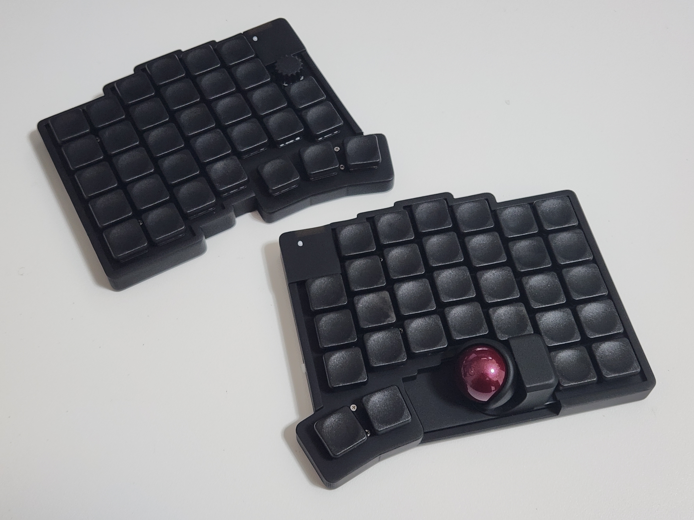
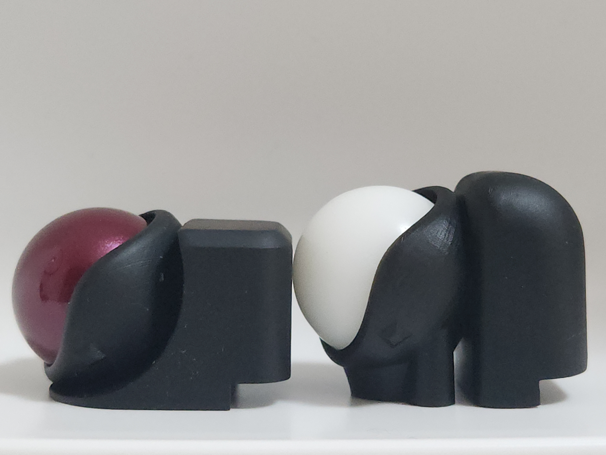
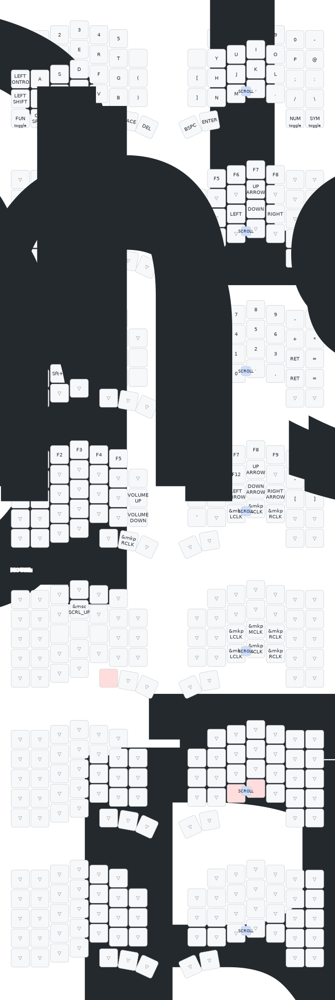

# zmk-config-glove65tb<!-- omit in toc -->

- Glove65tb用のZMKファームウェア

## Glove65tbとは<!-- omit in toc -->

- Xiao nRF52840 Plus（Xiao BLE Plus）を採用した技適対応のワイヤレスキーボード
- 低背トラボケース（25mmトラボ対応）により、従来比でトラボケース高さ`-7mm`, トラックボール高さ`-3.5mm`を実現し、手のひらとの干渉を防止
- Bluetooth接続（最大5台）とType-Cケーブルによる有線接続が可能
- `Cherry MXスイッチ`と`ロープロファイルスイッチ`（Choc V1, Choc V2_ガイドピン無し）に対応
- 500mAhバッテリーを採用しながら薄型デザインを実現
- 左側キーボードにロータリーエンコーダを搭載

## スペック表<!-- omit in toc -->

| 項目 | 詳細 |
| -- | -- |
| ファームウェア | ZMK Firmware |
| 接続方式 | 有線接続（Type-C） Bluetooth（最大5台） |
| 対応キースイッチ | ✅Choc V1 ✅Choc V2（ガイドピン無し） ❌Choc V2（ガイドピン有り） ✅Lofree Ghost（Choc V2互換） ✅CherryMX |
| バッテリー容量 | 500mAh |
| バッテリー駆動時間 | おおよそ1ヶ月ほど |
| ロータリーエンコーダ | ロープロファイル規格のエンコーダーを左側キーボードに配置 |

## キーボードレイアウト<!-- omit in toc -->

# Docs<!-- omit in toc -->

- [ZMKファームウェアをビルドしてキーマップを変更する](#zmkファームウェアをビルドしてキーマップを変更する)
  - [全体の流れ](#全体の流れ)
  - [1. GitHubアカウントを作成する](#1-githubアカウントを作成する)
  - [2. ZMKファームウェアのリポジトリをフォークする](#2-zmkファームウェアのリポジトリをフォークする)
  - [3. GitHub Actionsの有効化](#3-github-actionsの有効化)
  - [4. KeymapEditorとフォークしたリポジトリを連携する](#4-keymapeditorとフォークしたリポジトリを連携する)
  - [5. KeymapEditorでキー配列変更してファームウェアをビルドする](#5-keymapeditorでキー配列変更してファームウェアをビルドする)
  - [6. ファームウェアをキーボードに書き込む](#6-ファームウェアをキーボードに書き込む)
    - [6-1. 右側キーボードにファームウェアを書き込む](#6-1-右側キーボードにファームウェアを書き込む)
    - [6-2. 左側キーボードにファームウェアを書き込む](#6-2-左側キーボードにファームウェアを書き込む)
  - [7. 完了](#7-完了)
- [ZMK Studioでキーマップを変更する](#zmk-studioでキーマップを変更する)
  - [1. `右側キーボード`とPCをType-Cケーブルで接続する](#1-右側キーボードとpcをtype-cケーブルで接続する)
  - [2. `ZMK Studio`にアクセス](#2-zmk-studioにアクセス)
  - [3. キーマップを変更するキーボードを選択](#3-キーマップを変更するキーボードを選択)
  - [4. キーマップを変更する](#4-キーマップを変更する)
  - [5. 完了](#5-完了)
- [Tips](#tips)
  - [`ZMKファームウェアをビルドしてキーマップを変更する`と`ZMK Studioでキーマップを変更する`を併用することは非推奨](#zmkファームウェアをビルドしてキーマップを変更するとzmk-studioでキーマップを変更するを併用することは非推奨)
  - [左側キーボードでキー入力ができなくなった](#左側キーボードでキー入力ができなくなった)
  - [ロータリーエンコーダを取り外してキースイッチを取り付け可能](#ロータリーエンコーダを取り外してキースイッチを取り付け可能)

## ZMKファームウェアをビルドしてキーマップを変更する

### 全体の流れ

1. GitHubアカウントを作成する
2. ZMKファームウェアのリポジトリをフォークする
3. GitHub Actionsの有効化
4. KeymapEditorとフォークしたリポジトリを連携する
5. KeymapEditorでキー配列変更してファームウェアをビルドする
6. ファームウェアをキーボードに書き込む

### 1. GitHubアカウントを作成する

- 以下のドキュメントを参考にアカウント作成すること

  > 公式ドキュメント:
  > https://docs.github.com/ja/get-started/start-your-journey/creating-an-account-on-github
  >
  > 参考ブログ:
  > https://zenn.dev/keison8864/articles/069d9be35b92c2
  >

### 2. ZMKファームウェアのリポジトリをフォークする

- 以下のリポジトリをフォークする
  - https://github.com/keebkuro/zmk-config-glove65tb
- フォーク手順は以下の記事を参考に実施すること

  > 公式ドキュメント:
  > https://docs.github.com/ja/pull-requests/collaborating-with-pull-requests/working-with-forks/fork-a-repo
  >
  > 参考ブログ:
  > https://www.kagoya.jp/howto/rentalserver/webtrend/githubfork/
  >

### 3. GitHub Actionsの有効化

- フォークしたリポジトリの「Actions」タブに移動し、「I understand my workflows, go ahead and enable them」をクリックし、github Actionsを有効化

  

### 4. KeymapEditorとフォークしたリポジトリを連携する

- [KeymapEditor](https://nickcoutsos.github.io/keymap-editor/)にアクセス
- `GitHub` を選択

  

- 「Login with GitHub」からでログインし、「Authorize Keymap Editor」を選択
- 指示に従い、フォークしたリポジトリにKeymapEditorがアクセスできるように進める

### 5. KeymapEditorでキー配列変更してファームウェアをビルドする

- [KeymapEditor](https://nickcoutsos.github.io/keymap-editor/)上でキーマップが表示されたら、好きにキーマップを編集する
- 画面左上の「Save」を押すと、編集したキーマップが適用されてGitHub Actionsが走り、自動的にビルドが開始します

  

- 「Save」の隣に表示される「Latest」をクリックするとGitHubに移動し、ビルドが完了するとファームウェアがダウンロードできるようになります。（ビルドには2～4分かかる場合があります。）

### 6. ファームウェアをキーボードに書き込む

- ダウンロードしたzipファイルを解凍する

  

#### 6-1. 右側キーボードにファームウェアを書き込む

- `Reset Button`をダブルクリックしてブートモードに切り替える

  

- ブートモードのときにPCとキーボードをUSB接続すると`XIAO-SENSE`というリムーバルディスクが見えるようになります

  

- `XIAO-SENSE`に`glove65tb_R-seeeduino_xiao_ble-zmk.uf2`ファイルをドラッグアンドドロップしてください

  > 補足:
  > うまく動作しないときは、`settings_reset-seeeduino_xiao_ble-zmk.uf2`を先に書き込んでリセットしてから、上述のファームウェア書き込みを実施すると解消できます
  >

#### 6-2. 左側キーボードにファームウェアを書き込む

- 右側キーボードと同じ手順で実施可能です
- 書き込むファームウェアは左側キーボード用のものに読み替えてください（`glove65tb_L-seeeduino_xiao_ble-zmk.uf2`）

### 7. 完了

- キーボードのスイッチを入れ直して完了
- キー入力が正常に行えることを確認してください

## ZMK Studioでキーマップを変更する

### 1. `右側キーボード`とPCをType-Cケーブルで接続する

- 本キーボードは`右側キーボード`が親機になってますので、親機とPCをType-Cケーブルで有線接続すること

### 2. `ZMK Studio`にアクセス

- Chromeなどの任意のブラウザで[ZMK Studio](https://zmk.studio/)にアクセス
  - https://zmk.studio/

### 3. キーマップを変更するキーボードを選択

- `USB`を選択
  
- キーボードを選択するモーダルが表示されるので、`glove65tb (cu.usbmodem11301)`を選択してから`接続`をクリック
  

### 4. キーマップを変更する

- 変更後に右上の保存アイコンをクリックすると、変更内容をキーボードに書き込めます
  

### 5. 完了

- キーボードのスイッチを入れ直して完了
- キー入力が正常に行えることを確認してください

## Tips

### `ZMKファームウェアをビルドしてキーマップを変更する`と`ZMK Studioでキーマップを変更する`を併用することは非推奨

- ZMKファームウェアをビルドしてキーマップ変更したのに、ZMK Studioでのキーマップが優先されるケースがあるため
- キーマップがうまく書き換えできなくなった場合は、[6. ファームウェアをキーボードに書き込む](#6-ファームウェアをキーボードに書き込む)で`settings_reset-seeeduino_xiao_ble-zmk.uf2`を書き込む手順を含めて実行すると解消可能です

### 左側キーボードでキー入力ができなくなった

- 左右キーボード間のペアリングが失敗している状態です
- [6. ファームウェアをキーボードに書き込む](#6-ファームウェアをキーボードに書き込む)で`settings_reset-seeeduino_xiao_ble-zmk.uf2`を書き込む手順を含めて実行すると解消可能です
- `右側キーボード -> 左側キーボード`の順番で実行すると良いです

### ロータリーエンコーダを取り外してキースイッチを取り付け可能

- ロータリーエンコーダをハンダ付けしている箇所には、キーソケット（CherryMX, Choc V1/V2）もハンダ付け済みです
- はんだごてなどでロータリーエンコーダを取り外せばキースイッチを装着可能です
